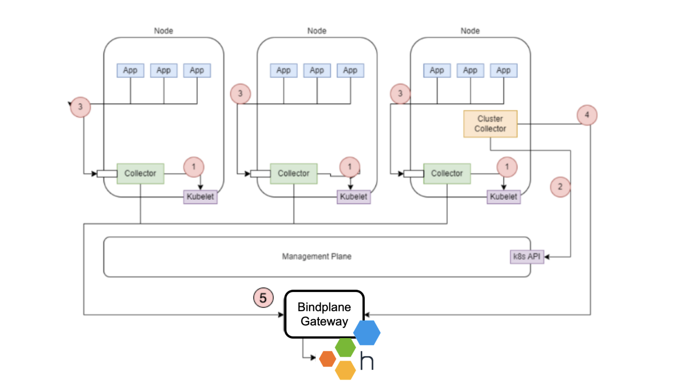
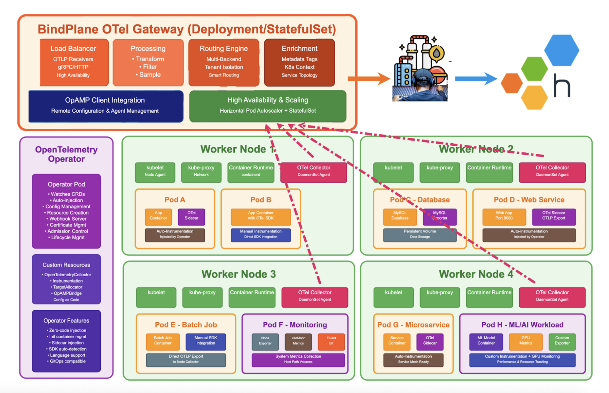
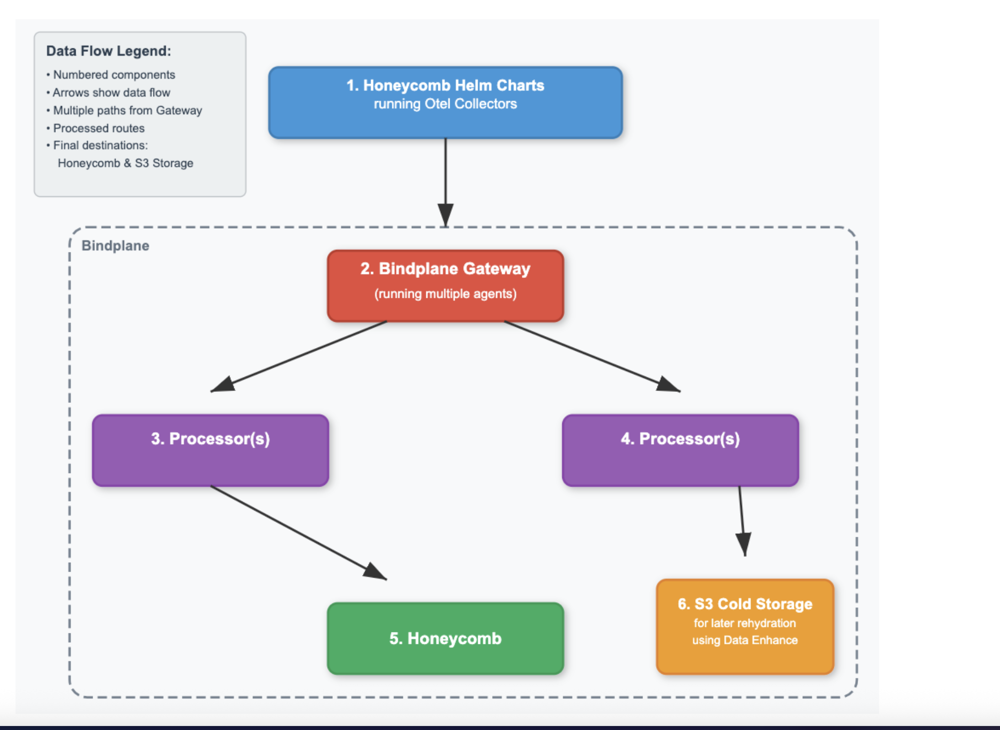

# Kubernetes Observability Architecture with Helm Charts and BindPlane

This document outlines one recommended architecture for comprehensive Kubernetes observability using Honeycomb's official Helm charts combined with BindPlane gateway collectors. This approach leverages two specialized Helm chart deployments to collect kubernetes telemetry and application telemetry, then routes all data through BindPlane for centralized processing, filtering, and forwarding to multiple destinations. This architecture significantly reduces operational overhead while providing enterprise-grade telemetry management and data governance capabilities.

## Table of Contents

- [Design](#design)
- [Operating BindPlane with Helm Chart Collectors](#operating-bindplane-with-helm-chart-collectors)
- [Upgrading Collectors](#upgrading-collectors)
- [Istio Integration (TBD)](#istio-integration-tbd)
- [Appendix](#appendix)

---

# Design

A bit of terminology before we start:

- Bindplane Agent is an OpenTelemetry Collector with OpAmp. Generic OpenTelemetry Collectors/Agents do not have OpAMP, which means they cannot be managed centrally.
- The Helm chart in the diagram uses generic OpenTelemetry Collectors. Bindplane does not manage these. Kubernetes will manage them. See details about upgrades for both at the end.

**Diagram Key:** For numbers 1 through 4, only _two Helm charts must be installed per Kubernetes_ _cluster_. See the appendix for more details on the telemetry this pulls in.

1. **Collector**: Each node will contain a Collector, which will use the node’s Kubelet API to gather metrics data about the node and the node’s pod resources.
   1. Add the hostmetrics receiver for pure hosts metrics data.
2. **Cluster Collector:** The entire cluster will contain a separate Deployment Collector, which will use the Kubernetes API to get details about Kubernetes Events, such as active deployments.
3. **App/Code:** If you instrument applications, they can use the node’s IP address to send telemetry data (logs, metrics, and traces) to the Collector local to the node.
4. **Transmit Telemetry**: Each Collector will send telemetry data directly to Honeycomb or Bindplane over gRPC.
5. **Destination:** At this step, telemetry arrives at Honeycomb (default) or Bindplane Gateway (Highly recommended).

## Detailed Pipeline Overview

#

#

# Operating BindPlane with Helm Chart Collectors

1. Box represents all the components from the previous diagram.
2. BindPlane gateway, which serves as the entry point into BindPlane. It receives OTLP and other telemetry formats.
3. Common processors mask sensitive data and filter so only certain data goes to Honeycomb (hot storage), including deduplicating logs, etc.
4. This piplein has fewer processors, such as masking sensitive data and transformers. This is the route to send all data for possible future rehydration and long-term storage.
5. Goes to Honeycomb or possibly to Refinery, Honeycomb's smart sampling proxy.
6. Goes to your S3 bucket for later rehydration with Data Enhance.

# Upgrading Collectors

For detailed upgrade procedures for both Helm Chart collectors and BindPlane collectors, see the [Upgrading Collectors Documentation](docs/upgrading-collectors.md).

#

# Istio Integration (TBD)

Istio using OpenTelemetry will work fine, reporting either collectors within the Otel Operator, if used, the collectors on the nodes, or in the cluster setup. TBD.

#

# Appendix

## Data Collection Reference

For comprehensive details on all telemetry data collected by the Kubernetes Helm Charts, see the [Data Collection Reference Documentation](docs/data-collection-reference.md).
